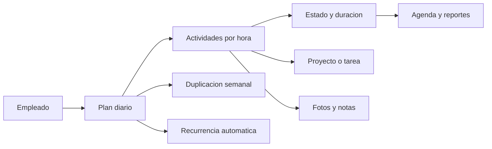

  

<h1 align="center">Planeación Operativa</h1>

  Gestión visual de horarios, actividades, evidencia fotográfica y carga diaria por empleado en Odoo 17.

  
  
  
  

---

## Vista General

Este módulo permite organizar la jornada operativa de cada empleado por franjas horarias, controlar el avance de cada actividad y detectar sobrecarga diaria cuando el total supera 8 horas.

Además, incluye evidencia visual de trabajo con foto principal, fotos adjuntas, notas operativas, agenda en calendario, duplicación semanal y plantillas recurrentes.

## Qué Resuelve

<table>
  <tr>
    <td width="33%" valign="top">
      <h3>⏰ Planeación por horas</h3>
      
Define actividades con hora de inicio, hora de fin, duración y total diario por empleado.

    </td>
    <td width="33%" valign="top">
      <h3>📸 Evidencia operativa</h3>
      
Adjunta foto principal, múltiples imágenes adicionales y observaciones por actividad.

    </td>
    <td width="33%" valign="top">
      <h3>🔁 Reutilización semanal</h3>
      
Duplica jornadas hacia semanas futuras o usa recurrencia automática para mantener la planeación.

    </td>
  </tr>
</table>

## Funcionalidades Principales

| Función | Descripción |
| --- | --- |
| 📋 Plan diario por empleado | Un plan por empleado y fecha, con nombre automático y relación con departamento y cargo. |
| 🕒 Actividades por franja horaria | Cada línea registra inicio, fin, duración, proyecto, tarea y notas. |
| 🎯 Estados operativos | Pendiente, En Progreso y Completado. |
| ⚠️ Control de sobrecarga | Detecta cuando el total diario supera 8 horas. |
| 📆 Agenda visual | Vista calendario, lista, formulario, búsqueda y análisis pivot. |
| 📷 Evidencia fotográfica | Foto principal y contador de imágenes adjuntas por actividad. |
| 🔁 Duplicación rápida | Duplica una actividad individual o una jornada completa a próximas semanas. |
| 🤖 Recurrencia automática | Los planes recurrentes se sincronizan y se proyectan hacia semanas futuras. |

## Flujo del Módulo

## Colores Operativos

| Estado | Color visual | Uso |
| --- | --- | --- |
| ⏳ Pendiente | Naranja | Actividad aún no iniciada |
| 🔄 En Progreso | Azul | Actividad en ejecución |
| ✅ Completado | Verde | Actividad finalizada |
| ⚠️ Sobrecarga | Rojo | Total diario superior a 8 horas |

## Vistas Disponibles

<table>
  <tr>
    <td>🧾 Lista</td>
    <td>📄 Formulario</td>
    <td>🗓️ Calendario</td>
    <td>📊 Pivot</td>
    <td>🔎 Búsqueda</td>
  </tr>
</table>

## Evidencia y Seguimiento

### Fotos

- Foto principal integrada en el formulario de la actividad.
- Imágenes adicionales mediante archivos adjuntos del registro.
- Contador visible desde el botón Fotos.
- Soporte para formatos habituales como JPG, PNG, GIF, BMP, WebP y TIFF.

### Notas

- Campo de observaciones de varias líneas.
- Útil para registrar novedades, incidencias o evidencia textual.
- Visible en formularios y utilizable como apoyo de seguimiento operativo.

## Instalación

1. Copia la carpeta employee_hourly_schedule dentro del directorio de addons.
2. Actualiza la lista de aplicaciones en Odoo.
3. Instala la aplicación Planeación Operativa.
4. Refresca el navegador con Ctrl+Shift+R para limpiar la caché de assets.

## Ubicación en Odoo

**Recursos Humanos → Planeación Operativa**

Menús disponibles:

- ✅ Mis Tareas
- 📅 Planes por Día
- 📊 Agenda Operativa
- 📈 Reporte por Empleado

## Modelos y Componentes

| Componente | Nombre técnico |
| --- | --- |
| Modelo principal | x_employee_hourly_schedule |
| Modelo de actividades | x_employee_hourly_schedule_line |
| Asistente de duplicación | x_employee_schedule_duplicate_wizard |
| Acción automática | cron_duplicate_recurrent_schedules |

## Dependencias

- base
- hr
- project
- web

## Información Técnica

| Campo | Valor |
| --- | --- |
| Categoría | Human Resources / Employees |
| Licencia | LGPL-3 |
| Tipo | Aplicación instalable |
| Compatibilidad | Odoo 17 |

## Desarrollador

<table>
  <tr>
    <td><strong>Nombre</strong></td>
    <td>Yerson Vargas Vargas</td>
  </tr>
  <tr>
    <td><strong>Rol</strong></td>
    <td>Desarrollador</td>
  </tr>
  <tr>
    <td><strong>Teléfono</strong></td>
    <td>3122919236</td>
  </tr>
  <tr>
    <td><strong>Correo</strong></td>
    <td>yervargas@gmail.com</td>
  </tr>
</table>

---

  <strong>Planeación más clara, seguimiento más visual y operación mejor controlada.</strong>

